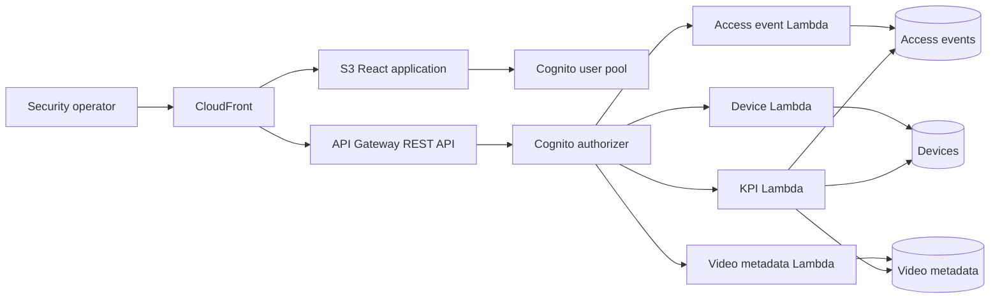

# Sentinel Ops

Sentinel Ops is the canonical unified Security Operations Platform for access control, device health, video metadata, and operational KPIs. It replaces the disconnected PACS, VMS, and KPI scaffolds with one npm workspace, one contract package, and one AWS CDK deployment path.

## Live portfolio demo

**[Launch Sentinel Ops](https://wats3082.github.io/System-pacs-security/)**

The GitHub Pages build is an explicitly labeled, in-browser simulation. It provides realistic access decisions, risk signals, investigation dispositions, fleet health, video metadata, and KPIs without connecting to real readers, credentials, people, Cognito, DynamoDB, or AWS APIs. State resets when the page reloads. This separation lets interviewers exercise the operator workflow safely while the production architecture remains deployable through CDK.

The Pages workflow builds with the repository path as Vite's asset base, runs type-checks and tests before publishing, and requires no secrets.

## Architecture



CloudFront serves the private S3 application and proxies `/api/*` to API Gateway, so the deployed browser uses a same-origin API. Cross-origin access is denied by default; a single explicit origin can be enabled with CDK context `allowedOrigin`.

## Technology

- Node.js 24 and npm 11 workspaces
- React 19, TypeScript, Vite, and `amazon-cognito-identity-js`
- AWS Lambda on `nodejs24.x`, API Gateway, Cognito, DynamoDB, S3, and CloudFront
- AWS SDK for JavaScript v3
- AWS CDK v2 as the only infrastructure definition
- Zod contracts shared by backend and frontend
- Vitest for service, handler, client, and CDK assertion tests

## Implemented capabilities

### Access events

- Evaluates credential status, subject roles, and optional UTC access schedules on the server; callers cannot submit a desired result to the policy endpoint.
- Records the policy version, matched roles, schedule result, deterministic risk score, and explainable signals with every evaluated decision.
- Supports denied-access case disposition with append-only, actor- and timestamp-attributed investigation notes.
- Validates every request with shared Zod contracts.
- Requires a caller-supplied UUID and uses a conditional DynamoDB write for idempotency.
- Returns the existing record for the same UUID and payload, or `409 CONFLICT` for UUID reuse with different data.
- Retrieves newest-first audit pages with opaque continuation tokens.
- Filters by facility, device, access decision, and UTC time range.

### Devices

- Registers readers, cameras, sensors, and controllers in `OFFLINE` state.
- Updates device metadata and operational status.
- Records timestamped heartbeats and status.
- Lists devices with status, type, and facility filters plus pagination.

### Video

- Registers metadata, tags, source references, and recording details.
- Tracks `QUEUED`, `RUNNING`, `COMPLETE`, and `FAILED` processing states.
- Searches metadata by title, tags, facility, and source device.
- Filters and paginates the library by processing status.
- Does **not** upload, transcode, inspect, or analyze video binaries.

### KPI dashboard

The dashboard computes its seven-day view from persisted records, not fixtures:

- Access volume, grant/deny counts, denial rate, and daily access trend
- Online, degraded, offline, and maintenance device counts
- Fleet availability as `ONLINE / total devices`
- Video totals by processing state

## API

`GET /api/health` and `GET /api/config` are public. Every operational endpoint requires a valid Cognito ID token in `Authorization`.

| Method | Path | Purpose |
| --- | --- | --- |
| `GET` | `/api/health` | Service health |
| `GET` | `/api/config` | Public Cognito/browser identifiers |
| `POST` | `/api/events` | Idempotent access event ingest |
| `GET` | `/api/events` | Paginated/filterable audit |
| `POST` | `/api/devices` | Device registration |
| `GET` | `/api/devices` | Paginated/filterable device list |
| `PATCH` | `/api/devices/{deviceId}` | Device metadata/status update |
| `POST` | `/api/devices/{deviceId}/heartbeat` | Device heartbeat |
| `POST` | `/api/videos` | Video metadata registration |
| `GET` | `/api/videos` | Searchable/paginated video library |
| `PATCH` | `/api/videos/{videoId}` | Processing status update |
| `GET` | `/api/kpis/summary?windowDays=7` | Persisted operational KPI summary |

Errors use:

```json
{
  "error": {
    "code": "VALIDATION_ERROR",
    "message": "Request validation failed",
    "requestId": "aws-request-id",
    "details": []
  }
}
```

## Cognito and safe login bootstrap

The CDK stack creates a user pool and public web client with SRP authentication, disabled self-signup, email recovery, enumeration protection, and a 12-character complexity policy. API Gateway enforces the user-pool authorizer before invoking operational Lambdas. The frontend restores Cognito sessions, refreshes tokens through the Cognito SDK, handles temporary-password replacement, and signs out locally.

After deployment, create a user without storing a password in source or logs:

```bash
npm run user:create -- --user-pool-id <UserPoolId output> --email operator@example.com --region us-east-1
```

Cognito generates a temporary password and sends it directly to the email address. The user must replace it during first sign-in. The deploy workflow can run this step idempotently when the non-secret repository variable `DEMO_USER_EMAIL` is set.

## Security and threat model

**Protected assets:** badge identifiers, policy evidence, access decisions, investigation records, device health, and operator identities.

| Threat | Control |
| --- | --- |
| Client forges a grant | `/events/evaluate` derives the decision from validated credential, role, and schedule evidence |
| Event replay or UUID substitution | Conditional writes and payload hashes make ingest idempotent and reject conflicting UUID reuse |
| Investigator rewrites history | Dispositions append actor/timestamp entries; DynamoDB point-in-time recovery and API logs support reconstruction |
| Cross-tenant reads or updates | Tenant keys constrain queries and conditional investigation updates |
| Anonymous operational access | Cognito authorizer protects every operational route; only health/config are public |
| Browser/API data leakage | Same-origin CloudFront proxy, no-store API responses, explicit CORS allowlist, TLS, and security headers |
| Compromised function pivots | Domain Lambdas receive narrow table/action IAM grants |

Trust boundaries are the browser, Cognito, API Gateway, Lambda policy/application code, and DynamoDB. The current policy input is supplied by the authenticated integration and is suitable for demonstrating decision engineering, not for production credential authority. A production PACS should source credential and policy facts from signed controller messages or authoritative identity/policy stores, add anti-passback and reader attestation, and enforce MFA plus Cognito groups for operators.

## Demo flows

1. Open **Policy decisions & investigations** and evaluate the prefilled active employee during the allowed window for a grant.
2. Change the role to `contractor`, credential to `SUSPENDED`, or time outside `07:00-19:00 UTC` to produce explainable denial signals and a higher risk score.
3. Add an investigation note and disposition. Expand **Audit history** to see immutable actor/time attribution.
4. Use decision, facility, and reader filters; then inspect **Operations**, **Device fleet**, and **Video library** for correlated context.

## Local development and validation

Prerequisites: Node.js 24 and npm 11.

```bash
npm ci
npm run typecheck
npm test
npm run build
npm run synth --workspace @sop/infra
```

The frontend receives runtime Cognito configuration from deployed `/api/config`. To run Vite against a deployed CloudFront surface:

```powershell
$env:VITE_PROXY_TARGET = "https://<distribution-domain>"
npm run dev
```

There is intentionally no mock API or fallback dataset. A failed configuration or API request renders a visible error state.

## Deployment

Use standard AWS environment credentials locally, or configure GitHub OIDC with repository variables `AWS_DEPLOY_ROLE_ARN` and `AWS_REGION`.

```bash
npm ci
npm run build
npm run bootstrap --workspace @sop/infra -- aws://<account-id>/<region>
npm run deploy --workspace @sop/infra -- --require-approval never
```

The single stack creates and connects Cognito, API Gateway, six Lambda functions, three DynamoDB tables and their indexes, CloudFront, and a private S3 frontend bucket. Tables use on-demand billing, AWS-managed encryption, point-in-time recovery, deletion protection, and retained removal policies. Lambda roles receive only the DynamoDB actions required by each domain.

`.github/workflows/ci.yml` installs, audits production dependencies, typechecks, tests, builds every workspace, and synthesizes CDK. `.github/workflows/deploy.yml` deploys through GitHub OIDC, optionally creates the demo user, verifies the frontend and health endpoint, and confirms operational endpoints reject unauthenticated requests.

`.github/workflows/pages.yml` publishes the static simulation on pushes to `main`. Repository Pages must use **GitHub Actions** as its build source. No deployment secret is required.

## Design tradeoffs and interview talking points

- **Decision integrity over CRUD breadth:** a dedicated policy endpoint computes decisions and preserves evidence rather than trusting a browser-supplied `GRANTED`.
- **Explainability over opaque anomaly ML:** deterministic signals and risk weights are reviewable, testable, and appropriate for sparse demo data; mature deployments can version and calibrate this engine.
- **Append-only case activity:** compact investigation history lives with the event for atomic updates and easy retrieval; at scale, use a separate case/activity table with conditional versioning and retention controls.
- **One codebase, two honest modes:** AWS mode uses Cognito/Lambda/DynamoDB; Pages injects a typed in-memory adapter and unmistakable simulation banner.
- **Operational resilience:** conditional idempotency, delayed-heartbeat protection, structured error envelopes, request IDs, least privilege, tracing, and explicit empty/loading/error states are first-class behavior.
- **Accessible operator UX:** keyboard-visible focus, semantic alerts/status, labeled controls, responsive evidence grids, and reduced-motion handling support control-room and mobile use.

## MVP limitations

- The deployment is single-tenant; `tenantId` defaults to `default` and can be changed with CDK context.
- Video is metadata-only. Binary upload, playback, transcoding, and content analysis are not implemented.
- KPI aggregates are computed on request from the selected DynamoDB indexes; high-volume deployments should add materialized time buckets.
- Device heartbeats are API-driven; there is no IoT transport or automatic offline scheduler.
- Cognito groups and granular operator authorization are not yet implemented; authenticated users share the operational tenant. Subject access roles are policy inputs, not operator permissions.
- MFA is not enabled in this MVP; the frontend currently supports SRP password authentication and first-login password replacement.
- No live deployment is claimed until AWS credentials are supplied and the deploy workflow smoke tests pass.
